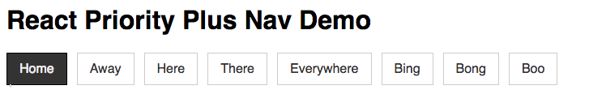
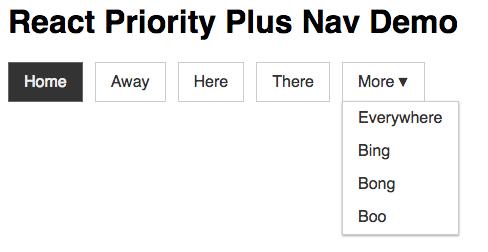
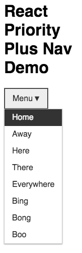

# react-priority-plus-nav

[](https://travis-ci.org/cliener/priority-plus-nav)
[](https://badge.fury.io/js/react-priority-plus-nav)
[](https://coveralls.io/github/cliener/priority-plus-nav?branch=master)

Need a robust React responsive menu for your site? Look no further than the priority plus pattern. The pattern has been well described by [Brad Frost](http://bradfrost.com/blog/post/revisiting-the-priority-pattern/ "Revisiting the Priority+ Pattern") and [CSS Tricks](https://css-tricks.com/the-priority-navigation-pattern/ "The Priority+ Navigation Pattern").

## Features

Take a horizontal menu…



…squish it…



…and some more…



…and the menu doesn't break!

* Robust, resposive and acessible navigation.
* Ideal when you don't have control of menu content.
* Overflow switches from default "More" to "Menu" when there's only one menu item left.
* Supports localised "More" and "Menu" labels.
* Tabbing and keyboard menu activation work as you would hope.
* Intelligent wrapping - if there is only one item that can't fit, the previous sibling is also wrapped. Launching a menu for one item isn't a great experience.
* All this and less than 2KB gzipped.

## Installation

```
$ npm i react-priority-plus-nav
```

Import into your react project:

```
import PriorityPlusNav from "react-priority-plus-nav";
```

Import the base styles and then set your custom menu styles. The [demo styles](./demo/src/demo.scss) should act as a good starting point.

```
@import "~react-priority-plus-nav/es/ppnav";
```

## Demo

Clone this repo and run `npm install && npm start` on your localhost to see it in action.

## Parameters

### menuItems

Array of menu item objects. If you override `renderMenuItem` below, you can set apply any custom properties in here.

```
{
  uri: "", // path
  label: "", // menu item label
  isActive: true, // indicates the current menu item is active i.e. we're on this page
}
```

### menuText [optional]

String label for the collapsed menu. Override for localisation purposes.

### moreText [optional]

String label for the overflowed menu. Override for localisation purposes.

### className [optional]

Class to sit at the top level of the rendered `<nav>` element. Helpful if you want class overrides outside the default `cdl-ppnav` namespace.

### renderMenuItem [optional]

Override the default menu item render function. You'll want to do this if you're using [React Router](https://github.com/ReactTraining/react-router) or similar.

```
const defaultRenderMenuItem = props => {
  const { itemDetails, captureRef, clickHandler, activeClass } = props;
  const { uri, label, isActive } = itemDetails;

  console.log("rendering");

  return (
    <li className={isActive ? activeClass : ""} key={uri} ref={captureRef} onClick={clickHandler}>
      <a href={uri}>{label}</a>
    </li>
  );
};
```
